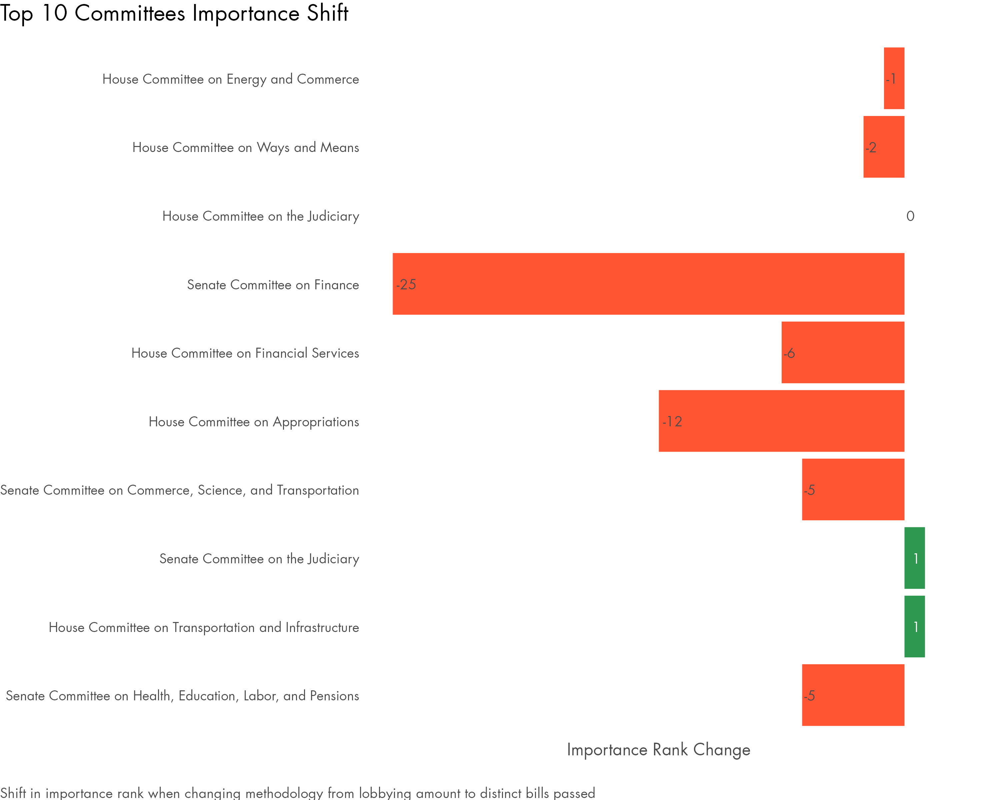

# polsci-DA-tech-test
Hi, I am William Terpstra & this repo is my submission for the technical test.
All relevant annotated scripts are contained in the directory labeled for the corresponding task.

## Task 1: SQL Queries

Refer to the .sql file in the Task1 folder for my annotated code that explains my thought process alongside additional validation queries.

### Question #1
Write a query that retrieves registrants whose total lobbying spend exceeds $10,000,000 (we call these "super-registrants"); your query should return all relevant cases, but your document output can be limited to the top 10.

#### Query
```
select
	r.registrant_name,
	sum(f.amount) as total_amount
from
	analyst.registrants r
left join analyst.filings f
on
	r.registrant_id = f.registrant_id
group by
	r.registrant_name
having
	sum(f.amount) > '$10,000,000.00'
order by
	sum(f.amount) desc
```
#### Result
| registrant_name | total_amount |
|-----------------|--------------|
| CHAMBER OF COMMERCE OF THE U.S.A. | $61,350,000.00 |
| NATIONAL ASSOCIATION OF REALTORS | $47,160,000.00 |
| U.S. CHAMBER INSTITUTE FOR LEGAL REFORM | $44,680,000.00 |
| AKIN GUMP STRAUSS HAUER & FELD | $39,985,000.00 |
| NCTA - THE INTERNET & TELEVISION ASSOCIATION | $30,870,000.00 |
| SQUIRE PATTON BOGGS | $29,265,000.00 |
| AMERICAN MEDICAL ASSOCIATION | $28,910,000.00 |
| BROWNSTEIN HYATT FARBER SCHRECK, LLP | $28,260,000.00 |
| BOEING COMPANY | $26,400,000.00 |
| PHARMACEUTICAL RESEARCH AND MANUFACTURERS OF AMERICA | $24,700,000.00 |

### Question #2
Select the five biggest registrants by dollar amount, and for each registrant, select their five biggest clients (each) by dollar amount in descending order; if any registrant has fewer than five, you may just list their clients.

#### Query
```
with top5_registrants as(
select
	r.registrant_id,
	r.registrant_name,
	sum(f.amount) as registrant_amount
from
	analyst.registrants r
left join analyst.filings f
on
	r.registrant_id = f.registrant_id
group by
	r.registrant_id, r.registrant_name
having
	sum(f.amount) is not null
order by
	registrant_amount desc
limit 5
),
-- Now let's look at filed payments by client
top5_registrants_client_payments as (
select
	t.registrant_id,
	t.registrant_name,
	t.registrant_amount,
	f.client_id,
	c.client_name,
	sum(f.amount) as client_amount,
	count(f.amount) as client_filed_payments,
	-- for internal ranking
	row_number() over (partition by t.registrant_id order by sum(f.amount) desc) as client_amount_rank
from
	top5_registrants t
left join analyst.filings f
on
	t.registrant_id = f.registrant_id
left join analyst.clients c 
on
	f.client_id = c.client_id
group by
	t.registrant_id,
	registrant_name,
	t.registrant_amount,
	f.client_id,
	c.client_name
having
	sum(f.amount) is not null
	)
select
	registrant_name,
	client_name,
	client_amount,
	client_amount_rank
from
	top5_registrants_client_payments
where
	client_amount_rank <= 5
order by
	registrant_amount desc,
	client_amount_rank asc
```
#### Result
| registrant_name | client_name | client_amount | client_amount_rank |
|-----------------|-------------|---------------|-------------------|
| CHAMBER OF COMMERCE OF THE U.S.A. | U.S. CHAMBER OF COMMERCE | $61,350,000.00 | 1 |
| NATIONAL ASSOCIATION OF REALTORS | NATIONAL ASSOCIATION OF REALTORS | $47,160,000.00 | 1 |
| U.S. CHAMBER INSTITUTE FOR LEGAL REFORM | U.S. CHAMBER INSTITUTE FOR LEGAL REFORM | $44,680,000.00 | 1 |
| AKIN GUMP STRAUSS HAUER & FELD | GILA RIVER INDIAN COMMUNITY | $3,840,000.00 | 1 |
| AKIN GUMP STRAUSS HAUER & FELD | CROW TRIBE | $2,330,000.00 | 2 |
| AKIN GUMP STRAUSS HAUER & FELD | SAMSUNG ELECTRONICS AMERICA, INC. | $1,740,000.00 | 3 |
| AKIN GUMP STRAUSS HAUER & FELD | ALLIANCE OF DEDICATED CANCER CENTERS | $660,000.00 | 4 |
| AKIN GUMP STRAUSS HAUER & FELD | PIPE LINE CONTRACTORS ASSOCIATION | $620,000.00 | 5 |
| NCTA - THE INTERNET & TELEVISION ASSOCIATION | NATIONAL CABLE & TELECOMMUNICATIONS ASSOCIATION | $30,870,000.00 | 1 |

### Question #3
Among all registrants, identify the registrant who has lobbied the most separate bills in the Medi-
care/Medicaid issue category. You can identify Medicare/Medicaid lobbying through the issue code
MMM. Write a query that returns the unique bill IDs that the registrant has lobbied; your query should
return all bill IDs, but your document output can be limited to a sample of 10.

#### Query
```
with top_mmm_registrant as (
select
	r.registrant_id,
	count(distinct(bill_id)) as distinct_bills
from
	analyst.registrants r
inner join analyst.filings f
on
	r.registrant_id = f.registrant_id
inner join analyst.filings_bills fb
on
	f.filing_uuid = fb.filing_uuid
	and fb.general_issue_code = 'MMM'
group by
	registrant_name,
	r.registrant_id
order by
	distinct_bills desc
limit 1
)
select
	distinct
bill_id
from
	top_mmm_registrant t
inner join analyst.filings f
on
	t.registrant_id = f.registrant_id
left join analyst.filings_bills fb
on
	f.filing_uuid = fb.filing_uuid
	and fb.general_issue_code = 'MMM'
```
#### Result
| bill_id |
|---------|
| hjres59-113 |
| hr1117-111 |
| hr1188-111 |
| hr1250-113 |
| hr1628-115 |
| hr1776-111 |
| hr1787-113 |
| hr1920-113 |
| hr1955-115 |
| hr2068-111 |

### Question #4
Most bills in the U.S. Congress have a title format that ends in "Act", "Law", or "Resolution". Call these
bills "standard titles". Write a query that counts how many bills in the ‘bills‘ table have "standard"
titles and how many bills have "non-standard titles". Provide only the totals for each.

#### Note
Here I present 2 queries. You can read my notes in my script, but essentially ending in a year should be considered a standard format based on how frequently it occurs. Query #1 conforms to the question as written while Query #2 includes Acts/Laws/Resolutions that end in "of 2XXX" as well which I believe better captures the spirit of "standard titles." You could say this is the letter of the law vs the spirit of the law.

#### Query #1
```
select
	count(case when title ~* '(Act|Law|Resolution)$' then title else null end) as standard_titles,
	count(case when title ~* '(Act|Law|Resolution)$' then null else title end) as non_standard_titles
from
	analyst.bills
```
#### Result #1
| standard_titles | non_standard_titles |
|-----------------|---------------------|
| 14,978 | 32,338 |

#### Query #2
```
select
	count(case when title ~* '(Act|Law|Resolution)( of [12]\d{3})?$' then title else null end) as standard_titles,
	count(case when title ~* '(Act|Law|Resolution)( of [12]\d{3})?$' then null else title end) as non_standard_titles
from
	analyst.bills
```
#### Result #2
| standard_titles | non_standard_titles |
|-----------------|---------------------|
| 36,805 | 10,511 |

## Task 2: Technical Writing
My annotated code for this assignment can be found in the Task2 directory, `Analysis.Rmd`. This code explains my thought process for this task and contains additional validation queries. This code can be run if you extract the drop box contents to the data folder.

### Technical Report
Below is my brief technical report.

#### Defining Committee Importance
Given the available lobbying data, committee importance can be quantified by the amount registrants, companies that employ lobbyists, spend on each committee. Using a model where payments disclosed in registrant filings are distributed across the bills those filings reference, we can calculate the dollars-per-bill and sum them to determine total lobbying spend by committee. This metric then can be used to determine committees' importance based on quantifiable financial investment from interest groups.

The top ten totals by committee are plotted below:


As expected, the most important congressional committees all have jurisdiction over decisions with large financial implications. The House Committee on Energy and Commerce has the broadest jurisdiction of any congressional authorizing committee, covering everything from healthcare to energy policy, and consequently its top rank is appropriate and a good indicator for this methodology. Other influential committees like Ways and Means (taxation and revenue), Finance (Senate's economic policy arm), and Financial Services (banking and monetary policy) directly shape the nation's economic landscape through their oversight. Even the Judiciary Committee has significant second-order financial impact through its role in interpreting laws, particularly in antitrust and bankruptcy matters. The Appropriations Committee directly controls the disbursement of funds, while the remaining committees in the top 10 all have jurisdiction over large scale infrastructure and service investments.

#### Alternative Measures of Committee Importance
An alternative measure of committee importance that can be modeled using this data is the number of distinct bills passed by committee. While this metric provides insight into legislative productivity, it has inherent limitations as the quantity of passed legislation doesn't necessarily correlate with policy impact and thus importance.
The prominence of the House Committee on Rules at the top of this ranking (with 234 bills passed) reveals a potential bias in this methodology. The Rules Committee may process numerous procedural or administrative bills that, while high in number, might be relatively limited in scope or impact compared to major policy legislation handled by other committees. Still, the Rules Committee is a very important committee because it's rulemaking power is used by the Speaker to control which bills reach the House floor for consideration.


#### Comparing Methodologies
Comparing committee importance ranking methodologies, distinct bill passage ranking results in a 25 rank decline for the Senate Committee on Finance followed by a 12 rank decline for the House Committee on Appropriations. This demonstrates the limitations of this alternative methodology for ranking committee importance, which is biased against committees with financial jurisdiction that work on few but very impactful bills.


#### Data Integration Opportunities for Improved Committee Importance Ranking
To strengthen this analysis, I would incorporate two additional datasets: appropriations information and congressional member data. The current analysis relies solely on lobbying metrics, which only captures external interest in committees.
A more holistic measure of committee importance could be created by integrating internal, government data. Specifically, appropriations data mapped to committees would provide a powerful direct quantifier of importance, showing actual resource allocation rather than just outside influence. Congressional information would also enhance modeling committee importance. With this data, committee importance could be assessed on the effectiveness of its current members, as measured in a metric such as their volume of passed bills. Member seniority could provide another lens to assess committee importance, although this likely presents reversed causality, since senior members tend to be appointed to the most important committees due to their experience and political connections.

## Task 3: Code Sample

For task 3 the script I decided to share is a recent script I wrote to assess the health of a client's ongoing web platform migration. Every week this client migrates a dozen storefronts to the new platform. I run this script every week to generate a report assessing migration performance across storefronts and provide updates on the results. This makes it easy to quickly share pre & post KPI shifts for specific storefronts, assess the overall performance trends of the effort, and quickly identify post-launch issues for immediate remediation. This script is only one part of the repo which has additional components such as a custom typst extension.

**The script does the following:**

1. Connects to data sources in aws & google drive (tables, views, and a storefront launch tracker), authenticates for those sources, and pulls the relevant data
2. Processes analytics data for all migrated storefronts
3. Generates visualizations and tables comparing pre to post performance
4. Saves outputs to organized directories, including a summary table to the Full_Reports directory
5. Uses these outputs to generate single storefront pdfs to the Storefront_Reports folder for easy distribution
6. Combines all these single storefront migration report pdfs into a All_Storefronts_Report.pdf in the Full_Reports directory, for ease of browsing

## Conclusion
Well that is all. Wew. Thank you for reviewing my submission. I look forward to discussing it with you soon if I am selected for the next stage!